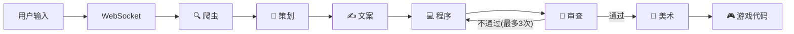

# 时光像素 · AI Agent 游戏工厂

> 输入一个计算机历史事件 → 6 个 AI Agent 协作 → 自动生成可玩的像素解谜网页游戏


---

## 30 秒看懂

```
你输入 "1940年 Turing 破译德军 Enigma 密码"
        ↓
   🔍 爬虫Agent    查史料（本地知识库命中 → 免费）
        ↓
   🎯 策划Agent    选谜题类型（cipher 密码破译）
        ↓
   ✍️ 文案Agent    写游戏剧本（300-500字沉浸叙事）
        ↓
   💻 程序Agent    生成 HTML 游戏（契约驱动，13条硬性要求）
        ↓
   🔎 审查Agent    两阶段检查（正则机械 + LLM 质量）
        ↓
   🎨 美术Agent    注入像素风 CSS（4套主题可选）
        ↓
   🎮 浏览器直接玩 ←── WebSocket 实时推送每一步进度
```

## 架构



## 技术栈

| 层 | 选型 | 为什么 |
|----|------|--------|
| Agent 编排 | **LangGraph StateGraph** | 有分支+条件回退，不是线性 Chain |
| LLM | **DeepSeek API** | 便宜、中文好 |
| 后端 | **FastAPI** | 原生异步 + WebSocket |
| 前端 | **React 19 + Vite** | 前后端分离 |
| 通信 | **WebSocket** | Agent 每步实时推送 |
| 审查 | **契约驱动 + 两阶段** | 正则验证结构(免费) + LLM 审查质量 |

## 6 个 Agent

| Agent | 职责 | LLM 调用 |
|-------|------|:--:|
| 🔍 爬虫 crawler | 先查本地知识库(10事件) → DeepSeek 兜底 | 仅 KB 未命中时 |
| 🎯 策划 planner | 基于史料选谜题类型(cipher/sequence/logic) | 1次 |
| ✍️ 文案 writer | 写游戏剧本(背景故事+谜题描述+台词) | 1次 |
| 💻 程序 coder | 按 13 条契约生成 HTML+CSS+JS 游戏 | 1次 |
| 🔎 审查 reviewer | Phase1 正则 + Phase2 LLM，不通过退 coder(最多3次) | 1次 |
| 🎨 美术 artist | 注入像素风 CSS(4 套主题可选) | 1次 |

## 快速开始

### 1. 环境准备

```bash
# Python 3.13 + venv
cd backend
python -m venv ../venv
../venv/Scripts/pip install -r requirements.txt

# Node.js
cd frontend
npm install
```

### 2. 配置 API Key

```bash
cp backend/.env.example backend/.env
# 编辑 backend/.env，填入 DEEPSEEK_API_KEY
```

### 3. 启动

```bash
# 终端1：后端
bash start-backend.sh    # → http://localhost:8000

# 终端2：前端
bash start-frontend.sh   # → http://localhost:5173
```

浏览器打开 `http://localhost:5173`，输入计算机历史事件即可。

## 项目结构

```
contract-review-agent/
├── backend/
│   ├── app/
│   │   ├── main.py              # FastAPI + WebSocket
│   │   ├── ws_manager.py        # WS 连接管理
│   │   ├── llm_client.py        # DeepSeek 封装(超时/重试/花费追踪)
│   │   ├── graph/
│   │   │   ├── state.py         # GameFactoryState
│   │   │   └── workflow.py      # LangGraph 编排
│   │   ├── agents/
│   │   │   ├── crawler.py       # 知识检索(KB+LLM)
│   │   │   ├── planner.py       # 谜题设计
│   │   │   ├── writer.py        # 剧本生成
│   │   │   ├── coder.py         # 游戏代码(契约驱动)
│   │   │   ├── reviewer.py      # 两阶段审查
│   │   │   └── artist.py        # 像素 CSS
│   │   ├── knowledge/
│   │   │   ├── verified_events.json  # 10个验证事件
│   │   │   └── pixel-theme.css
│   │   └── mcp/                 # MCP Server(待实现)
│   └── requirements.txt
├── frontend/
│   ├── src/
│   │   ├── App.jsx              # 双栏布局
│   │   ├── hooks/useWebSocket.js
│   │   ├── components/          # 6 组件
│   │   └── styles/pixel-theme.css # 液态玻璃主题
│   └── public/bg.mp4            # 视频背景
└── CLAUDE.md                    # AI 上下文
```

## 花费

单次生成约 **¥0.11**（5 次 LLM 调用，KB 命中时免爬虫费用）。查看 `/api/cost` 获取累计统计。

## License

MIT
