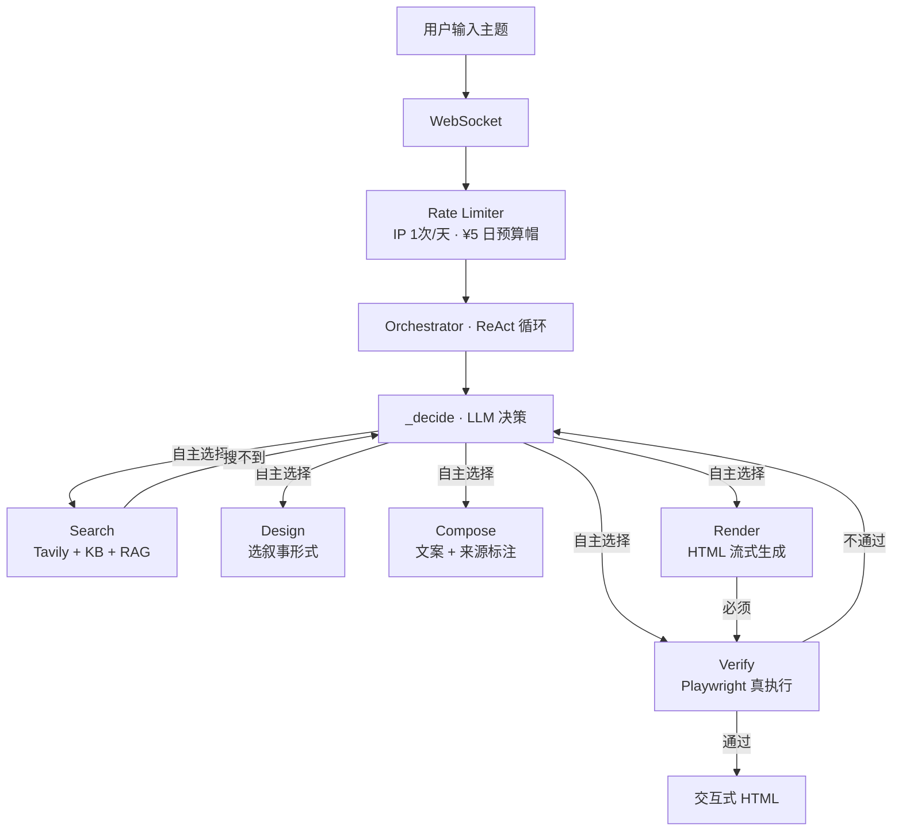

# AI-Native Workflow · 时光像素

> 输入任意主题 → LLM 自主决策每一步 → 生成交互式 HTML 页面
> 不是"调了 LLM 的流水线"，是 **LLM 自己决定流程** 的 AI 原生系统

[](LICENSE)


---

## 为什么是 AI-Native？

流程不是人写死的。LLM 自己决定：搜几次？跳过搜索直接用自身知识？审查不过退给谁？

| 传统 Pipeline | 本系统 |
|-------------|--------|
| 人决定"先搜→再设计→再写→再审查" | LLM 自主决策每一步调什么工具 |
| 审查不通过→固定退回上一步 | LLM 诊断病因→退回正确的节点 |
| 素材不足→硬着头皮生成→失败 | LLM 主动触发"诚实模式"降级 |
| 搜索死循环→耗尽预算 | 搜索 8 次硬拦截 + LLM 自身知识兜底 |
| 生成的代码对不对→LLM 自己猜 | Playwright 无头浏览器真执行验证 |

---

## 架构



**硬边界**（LLM 不能突破）：最多 20 步 · 预算 ¥1 · 搜索 ≤8 次 · render 后必须 verify · 连续 2 次 verify 失败强制终止。

---

## 快速开始

### 方式一：Docker（推荐——不需要装 Python/Node，一行命令）

```bash
git clone https://github.com/hfujw/ai-native-workflow.git
cd ai-native-workflow

# 配 Key（只需要做一次）
复制 backend/.env.example → 重命名为 backend/.env → 打开填入 DEEPSEEK_API_KEY=sk-xxxxxxxx

# 启动
docker-compose up
```

浏览器打开 `http://localhost:8000`。Docker 自带 Python、Playwright 浏览器、所有依赖——你不需要装任何东西。

### 方式二：手动启动（开发/改代码时用）

**前置要求**：Python 3.11+ · Node.js 18+ · DeepSeek API Key · Tavily Key（可选）

```bash
git clone https://github.com/hfujw/ai-native-workflow.git
cd ai-native-workflow

# 1. 配 Key
cp backend/.env.example backend/.env
# 编辑 backend/.env：DEEPSEEK_API_KEY=sk-xxxxxxxx

# 2. 后端
cd backend
python -m venv venv
venv\Scripts\pip install -r requirements.txt      # Windows
# python3 -m venv venv && source venv/bin/pip install -r requirements.txt  # macOS/Linux
venv\Scripts\python -m uvicorn app.main:app --port 8001

# 3. 前端（新终端）
cd frontend
npm install
npm run dev
```

浏览器打开 `http://localhost:5173`。

### 首次启动说明

- ChromaDB 中文模型（~400MB）首次自动从 `hf-mirror.com` 下载，国内镜像不需代理
- 下载失败不影响使用——语义检索不可用，关键词 + LLM 自身知识仍然工作
- Tavily Key 不配也没关系——搜索返回空，LLM 用自己的知识

---

## 项目结构

```
backend/app/
├── main.py                 FastAPI + WebSocket 入口
├── config.py               pydantic-settings 集中配置
├── exceptions.py           自定义异常体系
├── llm_client.py           AsyncOpenAI 封装 + 流式输出
├── tools.py                5 个工具（search/design/compose/render/verify）
├── ws_manager.py           WebSocket 连接管理 + 优雅关闭
├── rate_limiter.py         IP 限流 + 日预算帽
├── circuit_breaker.py      断路器（三态状态机）
├── metrics.py              Prometheus /metrics 端点
├── demo.py                 Demo 预生成页面管理
├── agents/
│   └── orchestrator.py     ReAct 编排主循环
├── knowledge/
│   ├── kb.py               33 个示例话题 + 关键词检索
│   └── vector_store.py     ChromaDB 语义向量检索
└── state/
    ├── base.py             状态抽象层（Memory/Redis）
    ├── memory.py           内存实现
    └── agent_state.py      AgentState 数据结构

backend/demos/              预生成 HTML（本地跑一次替换）
backend/tests/              28 个 pytest 用例

frontend/src/
├── App.jsx                 主布局（液态玻璃 + 光标聚光灯）
├── components/
│   ├── DecisionLog.tsx     AI 思考流程（步骤进度线 + 实时滚动）
│   ├── StoryPanel.tsx      生成页面展示（显影动画 + 流式渲染）
│   ├── SearchBubble.tsx    搜索输入框
│   ├── EventTags.tsx       33 个示例话题标签云
│   ├── RevealLayer.tsx     光标聚光灯 Canvas mask
│   ├── FailureNotice.tsx   失败提示 + demo 引导
│   └── ErrorBoundary.tsx   React 错误边界
└── hooks/
    └── useWebSocket.js     WebSocket + 断线重连 + 流式接收
```

---

## 关键设计决策

| 决策 | 为什么 |
|------|--------|
| 不用 LangGraph | 当前 5 个工具的复杂度用 async while 循环最合适。tool 接口已标准化为 state-in/state-out，预留了 LangGraph 迁移能力 |
| 验证层外置 | Playwright 真执行，不是 LLM 猜对错。正则硬规则 + 浏览器执行 + 事实核查三阶段 |
| 诚实模式 | 素材不足时 LLM 主动降级为"资料有限"的诚实页面，不编造事实 |
| 搜索是可选增强 | LLM 决策中心——有把握的话题直接跳过搜索，不确定才搜。搜索不到 LLM 用自身知识兜底 |
| Tavily 替代 Bing | 国内可直连，返回 JSON 已清洗文本。不配 Key 也能跑 |
| 流式渲染 | `contentDocument.write` 写 DOM，不换 `srcdoc`——不频闪，用户看到页面逐段"长出来" |
| 断路器 | 连续 3 次 LLM API 失败自动熔断 30s，防止级联故障浪费重试和 Token |
| 预算控制 | 每个工具虚拟定价，总预算 ¥1 硬上限。IP 1 次/天试用 + 全站 ¥5/天，公网不破产 |

---

## 踩过的坑

| 现象 | 根因 | 修复 |
|------|------|------|
| 搜索"秦始皇修长城"返回空 | Bing API 国内不可用 | 换 Tavily + LLM 自身知识兜底 |
| iframe 实时刷新频闪 | React state 更新触发整页重渲染 | `contentDocument.write` 直接写 DOM，绕开 React 渲染周期 |
| 并发场景费用统计互相污染 | 全局 `_cost_records` 被多连接共享 | 每个 session 独立 `session_cost_records` 记账 |
| 心跳脉冲被当成工具完成 | `tool_result` 类型复用 | 新增 `heartbeat` 类型，前后端按类型过滤 |
| LLM 重复开场白（"我想了解…"） | DeepSeek 输出模板化 | orchestrator 检测关键词自动截断 + prompt 明确禁止 |

---

## 如果重新做，我会改什么

1. **搜索前置判断**：让 LLM 第一步自评知识置信度，高置信话题跳过搜索——减少延迟和成本
2. **WebSocket → SSE**：高并发时 WS 连接数会成为瓶颈，SSE 更轻量且支持 HTTP/2 多路复用
3. **多 Agent 拆分**：把 verify 拆成独立 Agent，支持 human-in-the-loop 审核节点
4. **RAG 升级**：当前 33 条硬编码 KB + 关键词匹配→升级为 ChromaDB 语义检索，已实现基础版

---

## 配置项

| 环境变量 | 默认值 | 说明 |
|---------|--------|------|
| `DEEPSEEK_API_KEY` | **必填** | DeepSeek API Key |
| `TAVILY_API_KEY` | 空（不配也能跑） | Tavily Search API Key |
| `DAILY_BUDGET` | 5.0 | 全站日预算（元） |
| `TRIALS_PER_IP` | 1 | 每 IP 每天试用次数 |
| `MAX_STEPS` | 20 | Agent 最大循环步数 |
| `GENERATION_TIMEOUT` | 300 | 单次生成超时（秒） |
| `LOG_PROMPTS` | 0 | 设为 1 记录完整 prompt（调试用） |

---

## 关键词

`ai-native` `ai-workflow` `llm-orchestration` `react-agent` `visual-storytelling` `ai-agent` `langchain-alternative` `playwright-verification` `deepseek-api` `fastapi-websocket` `chromadb` `prometheus` `tavily` `honest-ai` `circuit-breaker`
